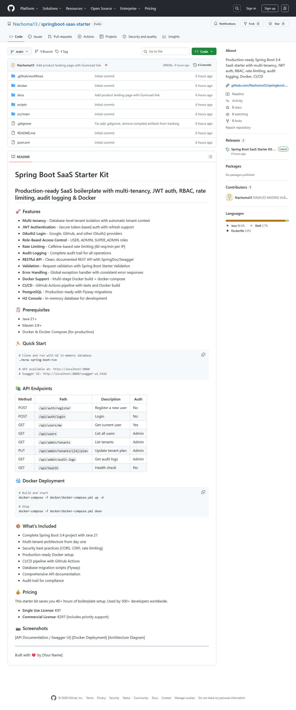
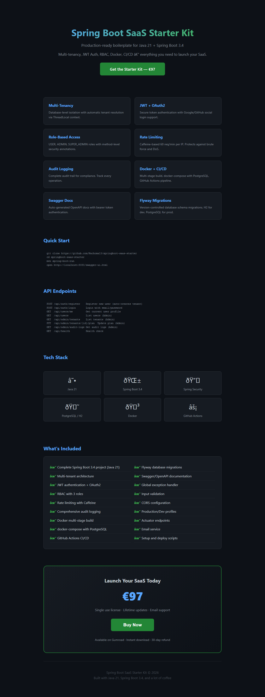

# Spring Boot SaaS Starter Kit

[](https://segurojuan.gumroad.com/l/adfauo)
[](https://github.com/Nachoma13/springboot-saas-starter/releases)
[](https://adoptium.net/)
[](https://spring.io/projects/spring-boot)
[](LICENSE)

**Launch your SaaS in hours, not weeks.** A production-ready Spring Boot starter kit with multi-tenancy, JWT authentication, RBAC, Stripe billing, and Docker support.



## 🚀 Why This Kit?

Stop writing boilerplate code. This kit gives you a complete, production-ready SaaS backend so you can focus on your actual product.

## ✨ Features

| Feature | Description |
|---------|-------------|
| **Multi-tenancy** | Database-level tenant isolation with automatic context switching |
| **JWT Auth** | Secure tokens with refresh support |
| **OAuth2** | Google & GitHub login out of the box |
| **RBAC** | USER, ADMIN, SUPER_ADMIN roles |
| **Rate Limiting** | 60 requests/min per IP (Caffeine-based) |
| **Audit Logging** | Full audit trail for compliance |
| **Stripe Billing** | Subscription management ready |
| **Swagger UI** | Auto-generated API documentation |
| **Docker** | Multi-stage build + docker-compose |
| **CI/CD** | GitHub Actions pipeline included |
| **Database** | PostgreSQL (Flyway) + H2 for dev |

## 🏃 Quick Start

```bash
# Clone the repo
git clone https://github.com/Nachoma13/springboot-saas-starter.git
cd springboot-saas-starter

# Run with H2 in-memory database
./mvnw spring-boot:run

# API: http://localhost:8080
# Swagger: http://localhost:8080/swagger-ui.html
```

## 📚 API Overview

| Method | Path | Description | Auth |
|--------|------|-------------|------|
| POST | `/api/auth/register` | Register user | No |
| POST | `/api/auth/login` | Login | No |
| GET | `/api/users/me` | Current user | Yes |
| GET | `/api/users` | List users | Admin |
| GET | `/api/admin/tenants` | List tenants | Admin |
| PUT | `/api/admin/tenants/{id}/plan` | Update plan | Admin |
| GET | `/api/admin/audit-logs` | Audit logs | Admin |
| GET | `/api/health` | Health check | No |

## 🐳 Docker

```bash
docker-compose -f docker/docker-compose.yml up -d
```

## 📦 What You Get

- Complete Spring Boot 3.4 project (Java 21)
- Multi-tenant architecture
- JWT + OAuth2 authentication
- Role-based access control
- Stripe payment integration ready
- Production Docker setup
- GitHub Actions CI/CD
- Flyway database migrations
- Swagger/OpenAPI docs
- Global error handling
- Request validation
- Rate limiting
- Audit logging

## 📖 Documentation

Full documentation: [nachoma13.github.io/springboot-saas-starter](https://nachoma13.github.io/springboot-saas-starter/)



## 💰 Pricing

**$19** — One-time payment. Full source code. Lifetime updates.

[](https://segurojuan.gumroad.com/l/adfauo)

---

Built with ❤️ by Nachoma13
